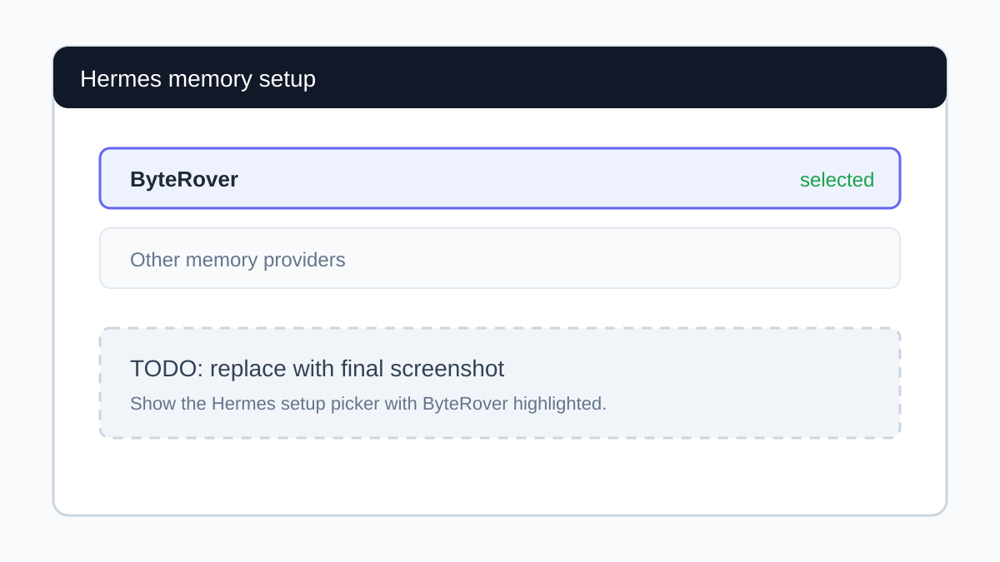
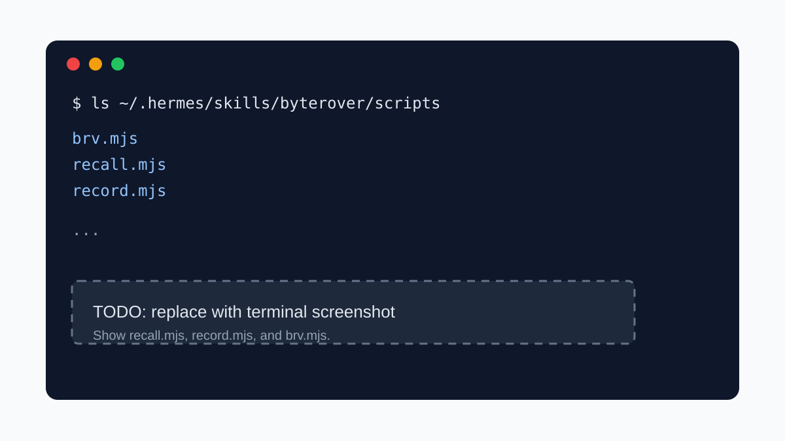
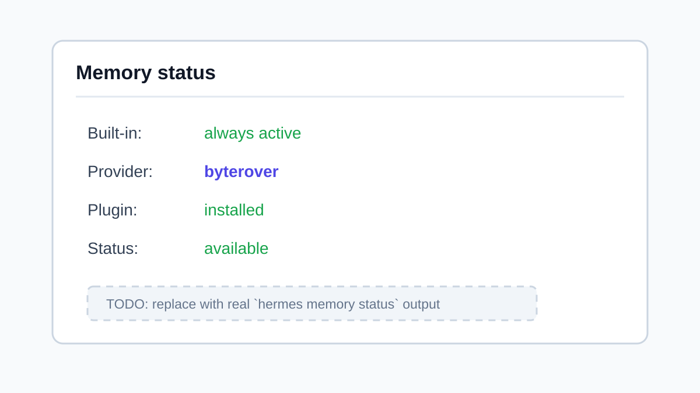

# ByteRover memory plugin (mono)

Persistent memory for Hermes via [byterover-mono](https://github.com/campfirein/byterover-mono).
Replaces the cli-binary backend (v1.x) — no more `brv` binary, no more
`brv curate` session protocol; this build calls mono's bundled `.mjs`
scripts (`recall.mjs`, `record.mjs`, `brv.mjs`) as one-shot subprocesses.

## End-user installation and usage guide

Use this section if you want to turn on ByteRover memory in Hermes and use it
day to day. The sections below are written for end users; the later sections
cover implementation details for maintainers.



_Placeholder image. Replace this with the final Hermes memory setup screenshot._

### What ByteRover adds to Hermes

ByteRover gives Hermes a durable project memory. When you ask Hermes to work
on a project, Hermes can recall relevant ByteRover topics before answering and
can save new decisions, fixes, rules, and project facts at the end of a useful
turn.

This version uses the ByteRover mono skill runtime. It does not require the
old `brv` binary or the old `BRV_API_KEY` setting. It does require Node.js and
the generated ByteRover skill scripts.

### Before you start

Install or confirm these requirements:

1. **Hermes** is installed and `hermes` works in your terminal.
2. **Node.js** is installed and available on `PATH`.
3. **ByteRover desktop** is installed if you want to create and manage named
   spaces visually.
4. **The ByteRover skill** is installed at:

```text
$HERMES_HOME/skills/byterover/
├── SKILL.md
└── scripts/
    ├── recall.mjs
    ├── record.mjs
    └── brv.mjs
```

If `HERMES_HOME` is not set, Hermes normally uses `~/.hermes`.

### Install the ByteRover skill

For a released build, install the published ByteRover skill artifact:

```bash
npx skills add campfirein/skills
```

For a pinned release:

```bash
npx skills add campfirein/skills@skill-vX.Y.Z
```

After installation, make sure Hermes can see the generated skill directory:

```bash
ls "${HERMES_HOME:-$HOME/.hermes}/skills/byterover/scripts"
```

You should see `recall.mjs`, `record.mjs`, and `brv.mjs`.

If you are testing from a local `byterover-mono` checkout instead of a release,
build the skill and link it into Hermes:

```bash
git clone https://github.com/campfirein/byterover-mono.git ~/workspaces/byterover-mono
cd ~/workspaces/byterover-mono
pnpm install
pnpm build:skill

mkdir -p "${HERMES_HOME:-$HOME/.hermes}/skills"
ln -s "$PWD/skills/byterover" \
  "${HERMES_HOME:-$HOME/.hermes}/skills/byterover"
```

Use a copy instead of a symlink if you want Hermes to use a fixed snapshot:

```bash
cp -R "$PWD/skills/byterover" "${HERMES_HOME:-$HOME/.hermes}/skills/byterover"
```



_Placeholder image. Replace this with a terminal screenshot showing
`recall.mjs`, `record.mjs`, and `brv.mjs`._

### Enable ByteRover in Hermes

Run the direct setup command:

```bash
hermes memory setup byterover
```

Or use the interactive picker:

```bash
hermes memory setup
```

You can also set the config manually:

```bash
hermes config set memory.provider byterover
```

Confirm that Hermes sees ByteRover:

```bash
hermes memory status
```

Expected result:

```text
Provider:  byterover
Plugin:    installed
Status:    available
```



_Placeholder image. Replace this with real `hermes memory status` output._

### Connect Hermes to a ByteRover space

Hermes runs ByteRover from this workspace identity:

```text
$HERMES_HOME/byterover/
```

ByteRover resolves the actual memory tree from that directory using its space
registry. If no space is bound yet, create a space in the ByteRover desktop app
first, then bind Hermes to it:

```bash
mkdir -p "${HERMES_HOME:-$HOME/.hermes}/byterover"
cd "${HERMES_HOME:-$HOME/.hermes}/byterover"
node "${HERMES_HOME:-$HOME/.hermes}/skills/byterover/scripts/space.mjs" bind "Hermes"
```

Check the active space:

```bash
node "${HERMES_HOME:-$HOME/.hermes}/skills/byterover/scripts/space.mjs" current
```


_Placeholder image. Replace this with the ByteRover desktop space screenshot._

### Use ByteRover in a Hermes chat

Start Hermes normally:

```bash
hermes
```

Then work as usual. Hermes will automatically ask ByteRover for relevant memory
before each substantive turn. When new durable knowledge is created, Hermes can
save it through the `brv_record` tool.

Useful prompts:

```text
Remember this project rule: all API keys must stay in .env files and never be committed.
```

```text
We fixed the login bug by refreshing the OAuth token before retrying the request. Save that.
```

```text
What do you remember about this project's authentication flow?
```

Good things to save:

- project rules and conventions
- architectural decisions
- recurring setup steps
- bug root causes and fixes
- facts the team should not rediscover later

Avoid saving:

- secrets
- one-off scratch notes
- private user data unless the user explicitly asks
- noisy logs or raw terminal output


_Placeholder image. Replace this with a Hermes chat screenshot showing a
successful ByteRover memory write._

### Verify recall and writes

To verify recall from the command line:

```bash
node "${HERMES_HOME:-$HOME/.hermes}/skills/byterover/scripts/recall.mjs" \
  "project authentication flow" \
  --cwd "${HERMES_HOME:-$HOME/.hermes}/byterover" \
  --limit 3
```

To list topics in the active ByteRover workspace:

```bash
cd "${HERMES_HOME:-$HOME/.hermes}/byterover"
node "${HERMES_HOME:-$HOME/.hermes}/skills/byterover/scripts/brv.mjs" list
```

To read a topic:

```bash
node "${HERMES_HOME:-$HOME/.hermes}/skills/byterover/scripts/brv.mjs" \
  read "project/authentication.html"
```

### Update ByteRover

If you installed from a release, update through the same skill distribution
flow you used to install it. If you linked a source checkout, pull and rebuild:

```bash
cd ~/workspaces/byterover-mono
git pull
pnpm install
pnpm build:skill
```

Then restart any long-running Hermes session so the provider picks up the new
scripts.

### Disable ByteRover

To turn off the external ByteRover provider while keeping Hermes built-in
memory enabled:

```bash
hermes memory off
```

To switch back later:

```bash
hermes memory setup byterover
```

### Troubleshooting

**`Status: unavailable` in `hermes memory status`**

Check Node.js and the skill scripts:

```bash
node --version
ls "${HERMES_HOME:-$HOME/.hermes}/skills/byterover/scripts/recall.mjs"
```

If the skill lives somewhere else, set:

```bash
export BYTEROVER_MONO_SCRIPTS_DIR="/path/to/skills/byterover/scripts"
```

**`No context tree found`**

Create or select a space in the ByteRover desktop app, then bind the Hermes
workspace:

```bash
cd "${HERMES_HOME:-$HOME/.hermes}/byterover"
node "${HERMES_HOME:-$HOME/.hermes}/skills/byterover/scripts/space.mjs" bind "Hermes"
```

**Hermes does not recall a newly saved item**

Try a more specific follow-up query, then verify the topic exists with:

```bash
node "${HERMES_HOME:-$HOME/.hermes}/skills/byterover/scripts/brv.mjs" list
```

**Old `brv` CLI instructions do not work**

This provider does not use the old `brv` binary, `brv curate` protocol, or
`BRV_API_KEY`. Use the generated `.mjs` scripts in the ByteRover skill instead.

### Image placeholders to complete later

The guide includes SVG placeholders so the README renders cleanly before final
screenshots are available. Replace these files with final assets, or update the
Markdown links if you choose different filenames:

| Placeholder file | Replace with |
|---|---|
| `assets/hermes-memory-setup-placeholder.svg` | Hermes memory setup with ByteRover selected |
| `assets/byterover-scripts-placeholder.svg` | Generated ByteRover skill scripts in the terminal |
| `assets/hermes-memory-status-placeholder.svg` | `hermes memory status` showing ByteRover active |
| `assets/byterover-space-placeholder.svg` | ByteRover desktop space named `Hermes` |
| `assets/hermes-chat-record-placeholder.svg` | Hermes chat saving a project rule into ByteRover |

Recommended replacement size: `1200x675` or another 16:9 screenshot. If you
replace an SVG with PNG or JPG, update the image link and keep the alt text
descriptive.

## How it integrates

| Hermes hook | What this plugin does |
|---|---|
| `system_prompt_block()` | Returns the current curate guidance every turn — IRON LAW + 19-element `<bv-*>` vocabulary + structural rules + the `brv_record` tool contract |
| `prefetch(query)` | Runs `node recall.mjs "<query>" --cwd $HERMES_HOME/byterover/ --limit 5`. Returns a `<byterover-context>` block with the matched topics' rendered HTML, or empty if nothing relevant. |
| `brv_record` tool | Agent calls this with `{path, html, overwrite?}`. The plugin shells `node record.mjs <path> --html '<bv-topic …>…</bv-topic>'`. record.mjs is one-shot — no kickoff/continuation session. |

**Storage workspace.** Hermes runs every mono subprocess from
`$HERMES_HOME/byterover/`. ByteRover resolves the context tree from that cwd
through its space registry; the actual tree lives under the ByteRover data dir,
not under the Hermes plugin directory. If no space is bound yet, create one in
the ByteRover desktop app, then bind `$HERMES_HOME/byterover/` with
`space.mjs bind`.

## Requirements

1. **Node.js** on `PATH` (any modern version).
2. **The assembled ByteRover skill** at `$HERMES_HOME/skills/byterover/`.
   Hermes expects this final layout:

```text
$HERMES_HOME/skills/byterover/
├── SKILL.md
└── scripts/
    ├── recall.mjs
    ├── record.mjs
    └── brv.mjs
```

## Install the skill

The Hermes plugin does not consume `apps/skill` directly. In
`byterover-mono`, `apps/skill` is the private source app: hand-authored docs
live in `apps/skill/skill/`, runtime entry points live in
`apps/skill/src/entries/`, and `pnpm build:skill` assembles the generated,
installable artifact at `skills/byterover/`.

Released builds are published to the public `campfirein/skills` repo for
`skills.sh` consumers:

```bash
# latest released skill
npx skills add campfirein/skills

# pinned release
npx skills add campfirein/skills@skill-vX.Y.Z
```

Whichever install path you use, the final directory must be available to
Hermes as `$HERMES_HOME/skills/byterover/`. For a source checkout:

```bash
git clone https://github.com/campfirein/byterover-mono.git ~/workspaces/byterover-mono
cd ~/workspaces/byterover-mono
pnpm install && pnpm build:skill

mkdir -p "${HERMES_HOME:-$HOME/.hermes}/skills"
ln -s "$PWD/skills/byterover" \
  "${HERMES_HOME:-$HOME/.hermes}/skills/byterover"
```

Use a copy instead of a symlink if you want a fixed snapshot. The source app
can also publish the same generated artifact with `pnpm publish:skill`, which
mirrors `skills/byterover/` into `campfirein/skills` and tags it as
`skill-vX.Y.Z`.

## Setup

```bash
hermes memory setup    # select "byterover"
```

Or manually:

```bash
hermes config set memory.provider byterover
```

If ByteRover reports that no context tree is bound for the Hermes workspace,
bind the cwd used by this plugin:

```bash
mkdir -p "${HERMES_HOME:-$HOME/.hermes}/byterover"
cd "${HERMES_HOME:-$HOME/.hermes}/byterover"
node "${HERMES_HOME:-$HOME/.hermes}/skills/byterover/scripts/space.mjs" bind "Hermes"
```

Spaces are provisioned in the ByteRover desktop app; `space.mjs bind` links
this Hermes workspace to one of those spaces.

## Config

| Env Var | Required | Description |
|---------|----------|-------------|
| `BYTEROVER_MONO_SCRIPTS_DIR` | No | Override the scripts directory. Use only when the skill is not installed at `$HERMES_HOME/skills/byterover/scripts`. |
| `BRV_DATA_DIR` | No | Override ByteRover's data directory; normally leave unset and let the bundled scripts resolve it. |

## What the agent sees

Every turn, Hermes injects:

1. **`system_prompt_block`** — the curate guidance. Tells the agent when
   to curate, the full `<bv-*>` vocabulary, the topic structure rules,
   and the `brv_record` tool contract.
2. **`prefetch` output** (when there's a query) — a `<byterover-context>`
   block with directive instructions and the retrieved topics as raw
   `<bv-topic>` HTML.

The agent decides whether to call `brv_record` after producing its
answer. There's no auto-curate, no `on_pre_compress` flush, no
`sync_turn` background job — Hermes' previous auto-curate hooks were
guessing what to save from raw message text; the agent picks better.

## Tool: `brv_record`

| Arg | Required | Description |
|---|---|---|
| `path` | yes | Slash-separated snake_case, no `.html` (e.g. `security/auth`) |
| `html` | yes | Bare `<bv-topic>...</bv-topic>` HTML document |
| `overwrite` | no | Replace existing topic. Default `false`. Use ONLY after reading + merging prior facts. |

Returns the JSON envelope from `record.mjs` verbatim:

```json
{ "ok": true, "data": { "created": true, "path": "...", "warnings": [] } }
```

On `ok: false`, the `error` field carries a human-readable message the
agent should surface.

## Migration from the cli-binary version

| v1.x (cli) | v2.0.0-mono.0 (this) |
|---|---|
| `brv` binary on PATH | `node` + mono `scripts/` dir |
| `brv_query` agent tool | recall is automatic via `prefetch()`; tool removed |
| `brv_curate` agent tool (natural-language content) | `brv_record` agent tool (structured `<bv-topic>` HTML) |
| `brv_status` tool | removed (no analog) |
| Per-turn auto-curate via `sync_turn` / `on_pre_compress` | removed; agent invokes `brv_record` directly |
| `BRV_API_KEY` env var | removed (no remote auth) |

If you have an existing tree at `$HERMES_HOME/byterover/.brv/context-tree/`
(cli layout), the mono build will NOT read it automatically. Mono resolves the
active tree through the workspace's bound ByteRover space under the ByteRover
data dir. Migrate by re-recording the topics into the bound space, or stay on
the v1.x cli plugin until you've migrated.
