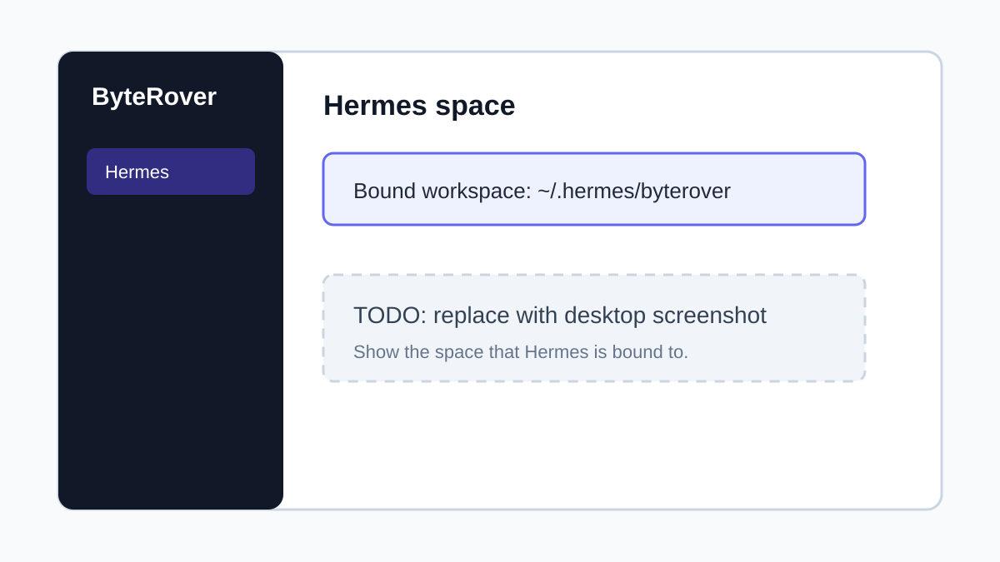
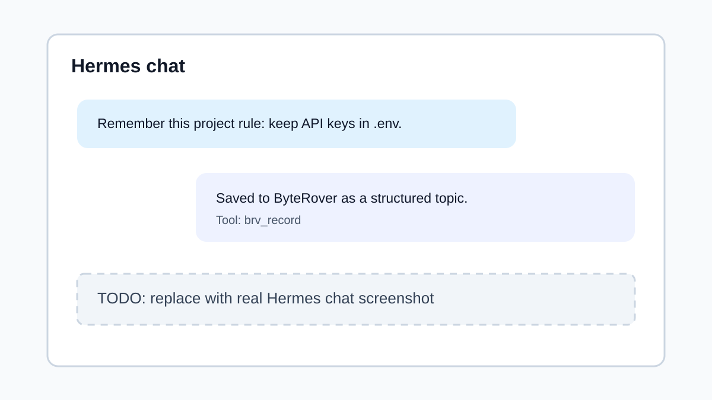

# ByteRover Memory For Hermes: End-User Installation And Usage

This guide explains how to install, enable, and use the ByteRover memory
provider in Hermes.

ByteRover gives Hermes durable project memory. Hermes can recall relevant
ByteRover topics before answering and can save new decisions, fixes, rules, and
project facts when there is something useful to remember.


_Placeholder image. Replace this with the final Hermes memory setup screenshot._

## What This Version Uses

This provider uses the ByteRover mono skill runtime. It does not use the old
`brv` binary, the old `brv curate` protocol, or `BRV_API_KEY`.

At runtime Hermes needs:

- Node.js on `PATH`.
- The generated ByteRover skill installed at `$HERMES_HOME/skills/byterover`.
- A ByteRover space bound to the Hermes workspace directory if you want named
  space management.

If `HERMES_HOME` is not set, Hermes normally uses `~/.hermes`.

## Before You Start

Install or confirm:

1. Hermes is installed and `hermes` works in your terminal.
2. Node.js is installed:

```bash
node --version
```

3. ByteRover desktop is available if you want to create and manage named
   spaces visually.
4. The ByteRover skill has this generated layout:

```text
$HERMES_HOME/skills/byterover/
├── SKILL.md
└── scripts/
    ├── recall.mjs
    ├── record.mjs
    └── brv.mjs
```

## Install The ByteRover Skill

For a released build, install the published ByteRover skill artifact:

```bash
npx skills add campfirein/skills
```

For a pinned release:

```bash
npx skills add campfirein/skills@skill-vX.Y.Z
```

After installation, make sure Hermes can see the generated scripts:

```bash
ls "${HERMES_HOME:-$HOME/.hermes}/skills/byterover/scripts"
```

You should see `recall.mjs`, `record.mjs`, and `brv.mjs`.


_Placeholder image. Replace this with a terminal screenshot showing
`recall.mjs`, `record.mjs`, and `brv.mjs`._

## Install From A Local ByteRover Mono Checkout

Use this path when you are testing unreleased ByteRover mono changes:

```bash
git clone https://github.com/campfirein/byterover-mono.git ~/workspaces/byterover-mono
cd ~/workspaces/byterover-mono
pnpm install
pnpm build:skill

mkdir -p "${HERMES_HOME:-$HOME/.hermes}/skills"
ln -s "$PWD/skills/byterover" \
  "${HERMES_HOME:-$HOME/.hermes}/skills/byterover"
```

Use a copy instead of a symlink if you want Hermes to use a fixed snapshot:

```bash
cp -R "$PWD/skills/byterover" "${HERMES_HOME:-$HOME/.hermes}/skills/byterover"
```

## Enable ByteRover In Hermes

Run the direct setup command:

```bash
hermes memory setup byterover
```

Or use the interactive picker:

```bash
hermes memory setup
```

You can also set the config manually:

```bash
hermes config set memory.provider byterover
```

Confirm that Hermes sees ByteRover:

```bash
hermes memory status
```

Expected result:

```text
Provider:  byterover
Plugin:    installed
Status:    available
```


_Placeholder image. Replace this with real `hermes memory status` output._

## Connect Hermes To A ByteRover Space

Hermes runs ByteRover from this workspace identity:

```text
$HERMES_HOME/byterover/
```

ByteRover resolves the actual memory tree from that directory using its space
registry. If no space is bound yet, create a space in the ByteRover desktop app
first, then bind Hermes to it:

```bash
mkdir -p "${HERMES_HOME:-$HOME/.hermes}/byterover"
cd "${HERMES_HOME:-$HOME/.hermes}/byterover"
node "${HERMES_HOME:-$HOME/.hermes}/skills/byterover/scripts/space.mjs" bind "Hermes"
```

Check the active space:

```bash
node "${HERMES_HOME:-$HOME/.hermes}/skills/byterover/scripts/space.mjs" current
```



_Placeholder image. Replace this with the ByteRover desktop space screenshot._

## Use ByteRover In A Hermes Chat

Start Hermes normally:

```bash
hermes
```

Then work as usual. Hermes automatically asks ByteRover for relevant memory
before each substantive turn. When new durable knowledge is created, Hermes can
save it through the `brv_record` tool.

Useful prompts:

```text
Remember this project rule: all API keys must stay in .env files and never be committed.
```

```text
We fixed the login bug by refreshing the OAuth token before retrying the request. Save that.
```

```text
What do you remember about this project's authentication flow?
```

Good things to save:

- project rules and conventions
- architectural decisions
- recurring setup steps
- bug root causes and fixes
- facts the team should not rediscover later

Avoid saving:

- secrets
- one-off scratch notes
- private user data unless the user explicitly asks
- noisy logs or raw terminal output



_Placeholder image. Replace this with a Hermes chat screenshot showing a
successful ByteRover memory write._

## Verify Recall And Writes

To verify recall from the command line:

```bash
node "${HERMES_HOME:-$HOME/.hermes}/skills/byterover/scripts/recall.mjs" \
  "project authentication flow" \
  --cwd "${HERMES_HOME:-$HOME/.hermes}/byterover" \
  --limit 3
```

To list topics in the active ByteRover workspace:

```bash
cd "${HERMES_HOME:-$HOME/.hermes}/byterover"
node "${HERMES_HOME:-$HOME/.hermes}/skills/byterover/scripts/brv.mjs" list
```

To read a topic:

```bash
node "${HERMES_HOME:-$HOME/.hermes}/skills/byterover/scripts/brv.mjs" \
  read "project/authentication.html"
```

## Update ByteRover

If you installed from a release, update through the same skill distribution
flow you used to install it. If you linked a source checkout, pull and rebuild:

```bash
cd ~/workspaces/byterover-mono
git pull
pnpm install
pnpm build:skill
```

Restart any long-running Hermes session so the provider picks up the new
scripts.

## Disable ByteRover

To turn off the external ByteRover provider while keeping Hermes built-in
memory enabled:

```bash
hermes memory off
```

To switch back later:

```bash
hermes memory setup byterover
```

## Troubleshooting

### `Status: unavailable` In `hermes memory status`

Check Node.js and the skill scripts:

```bash
node --version
ls "${HERMES_HOME:-$HOME/.hermes}/skills/byterover/scripts/recall.mjs"
```

If the skill lives somewhere else, set:

```bash
export BYTEROVER_MONO_SCRIPTS_DIR="/path/to/skills/byterover/scripts"
```

### `No context tree found`

Create or select a space in the ByteRover desktop app, then bind the Hermes
workspace:

```bash
cd "${HERMES_HOME:-$HOME/.hermes}/byterover"
node "${HERMES_HOME:-$HOME/.hermes}/skills/byterover/scripts/space.mjs" bind "Hermes"
```

### Hermes Does Not Recall A Newly Saved Item

Try a more specific follow-up query, then verify the topic exists:

```bash
node "${HERMES_HOME:-$HOME/.hermes}/skills/byterover/scripts/brv.mjs" list
```

### Old `brv` CLI Instructions Do Not Work

This provider does not use the old `brv` binary, `brv curate` protocol, or
`BRV_API_KEY`. Use the generated `.mjs` scripts in the ByteRover skill instead.

## Screenshot Placeholders To Complete Later

The guide includes SVG placeholders so the docs render cleanly before final
screenshots are available. Replace these files with final assets, or update the
Markdown links if you choose different filenames:

| Placeholder file | Replace with |
|---|---|
| `assets/hermes-memory-setup-placeholder.svg` | Hermes memory setup with ByteRover selected |
| `assets/byterover-scripts-placeholder.svg` | Generated ByteRover skill scripts in the terminal |
| `assets/hermes-memory-status-placeholder.svg` | `hermes memory status` showing ByteRover active |
| `assets/byterover-space-placeholder.svg` | ByteRover desktop space named `Hermes` |
| `assets/hermes-chat-record-placeholder.svg` | Hermes chat saving a project rule into ByteRover |

Recommended replacement size: `1200x675` or another 16:9 screenshot. If you
replace an SVG with PNG or JPG, update the image link and keep the alt text
descriptive.
